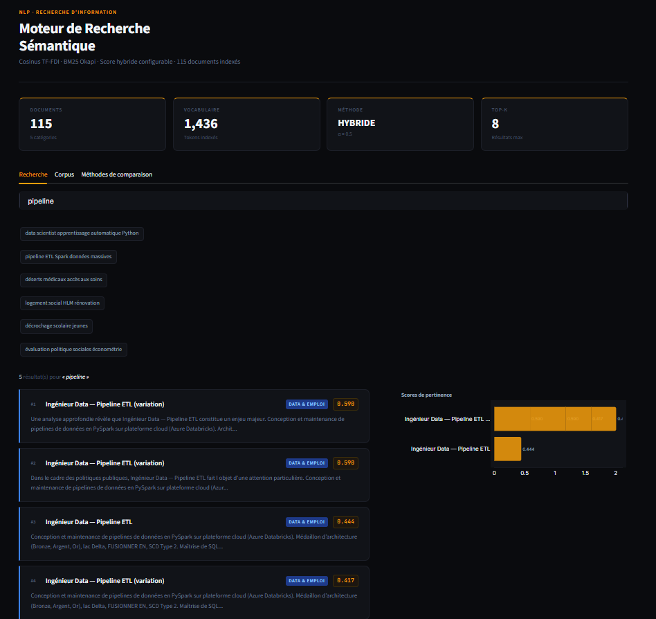
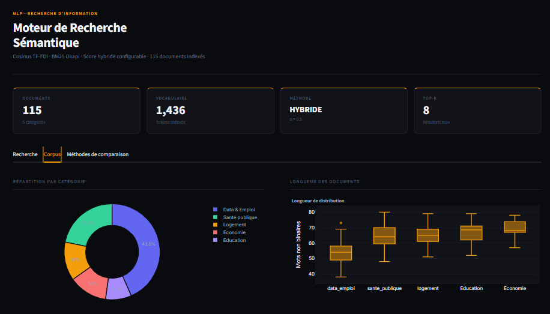
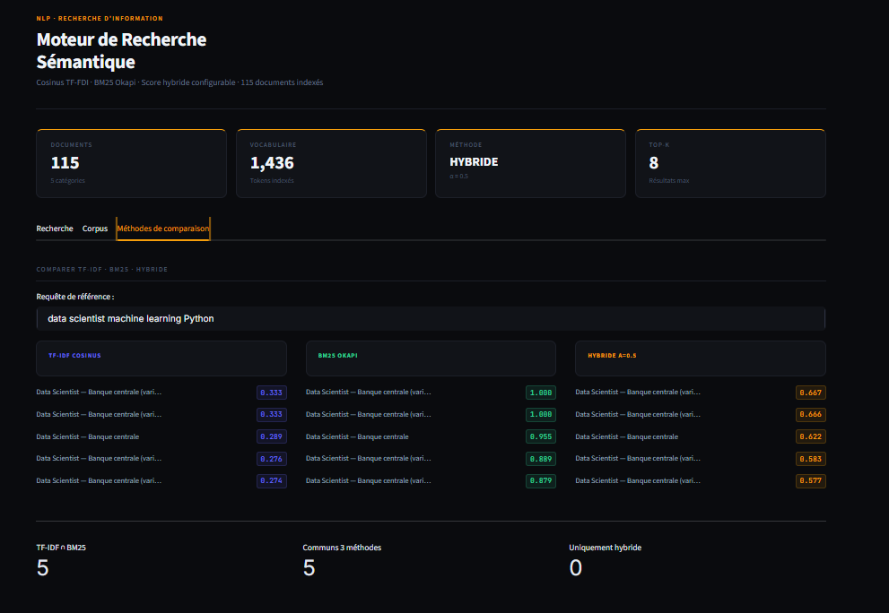

# NLP - Moteur de recherche sémantique (TF-IDF + BM25)

Moteur de recherche sur corpus textuel combinant **TF-IDF cosinus** et **BM25 Okapi** dans un score hybride configurable. Appliqué à un corpus de documents sur les politiques publiques et l'emploi data (115 documents). Architecture modulaire avec 20 tests unitaires.

---

## Fonctionnement

```
Requête utilisateur
      │
      ▼
Prétraitement (nettoyage, stopwords, tokenisation)
      │
      ├──► Score TF-IDF cosinus   ──┐
      │                              ├──► Score hybride = α·TF-IDF + (1-α)·BM25
      └──► Score BM25 Okapi      ──┘
                │
                ▼
         Ranking décroissant
                │
                ▼
         Top-K résultats (avec filtre catégorie optionnel)
```

**Pourquoi combiner TF-IDF et BM25 ?**

| Méthode | Force | Limite |
|---------|-------|--------|
| TF-IDF cosinus | Bonne sur longs documents, robuste à la longueur | Pas de saturation des termes répétés |
| BM25 Okapi | Saturation des termes, normalisation de longueur | Sensible aux paramètres k1, b |
| **Hybride** | **Combine les deux avantages** | Nécessite de calibrer α |

---

## Structure du projet

```
nlp-search-engine/
├── src/
│   ├── build_corpus.py    # Construction du corpus (115 documents)
│   ├── preprocessing.py   # Nettoyage et tokenisation
│   └── search_engine.py   # Moteur TF-IDF + BM25 + hybride
├── data/
│   └── corpus.json        # Corpus indexé
├── tests/
│   └── test_search_engine.py  # 20 tests unitaires
├── .streamlit/
│   └── config.toml        # Configuration Streamlit
├── app.py                 # Dashboard Streamlit interactif 
├── requirements.txt
└── README.md
```

---

## Utilisation

### Installation

```bash
pip install -r requirements.txt
```

### Dashboard Streamlit

```bash
streamlit run app.py
```

L'app s'ouvre sur `http://localhost:8501`

**Features du dashboard :**
-  Recherche hybride interactive (TF-IDF / BM25 / Hybride)
-  Visualisations temps réel (scores, répartition, longueur)
-  Paramètres configurables (α, top-k, catégories)
-  Comparaison directe des 3 méthodes
-  Statistiques corpus et vocabulaire

---

## Visualisations du Dashboard

### Onglet Recherche - Résultats hybrides

Interface de recherche interactive avec affichage des résultats rangés par score de pertinence. À gauche : liste des documents trouvés avec snippet et catégorie. À droite : graphique bar chart des scores.



### Onglet Corpus - Statistiques

- **Répartition par catégorie** : Donut chart montrant la distribution des 115 documents entre 5 catégories (Data & Emploi, Santé publique, Logement, Éducation, Économie)
- **Distribution des longueurs** : Box plot par catégorie montrant la variabilité du nombre de mots



### Onglet Comparaison - TF-IDF vs BM25 vs Hybride

Comparaison directe des 3 méthodes sur une même requête. Affiche les top-5 résultats pour chaque méthode avec code couleur distinctif et scores normalisés.

- **TF-IDF cosinus** (violet) : Approche classique par similarité cosinus
- **BM25 Okapi** (vert) : Approche probabiliste avec normalisation
- **Hybride α=0.5** (orange) : Combinaison équilibrée des deux

Statistiques en bas : intersection des résultats, communs aux 3 méthodes, et uniquement hybride.



---


### Utilisation en Python

```python
from src.search_engine import load_engine_from_file

# Charger et indexer
engine = load_engine_from_file("data/corpus.json", tfidf_weight=0.6)

# Recherche hybride
results = engine.search("data scientist machine learning Python", top_k=5)

# Avec filtre par catégorie
results = engine.search("pipelines ETL", category_filter="data_emploi", method="bm25")

for r in results:
    print(f"[{r['score']:.3f}] {r['title']}")
    print(f"  {r['preview']}")
```

---

| Catégorie | Documents | Contenu |
|-----------|-----------|---------|
| `data_emploi` | 50 | Offres d'emploi data, fiches de poste |
| `sante_publique` | 25 | Rapports DREES, politiques sanitaires |
| `logement` | 15 | Logement social, rénovation urbaine |
| `education` | 10 | Décrochage scolaire, service civique |
| `economie` | 15 | Conjoncture INSEE, évaluation d'impact |

---

## Tests

```bash
python3 -m pytest tests/ -v
```

Sortie attendue : `20 passed`

Les tests couvrent : initialisation, indexation, recherche (3 méthodes), filtre catégorie, requête vide, tri décroissant, gestion des erreurs.

---

## Stack technique


---

## Auteur

**Emmanuel KOURAOGO** 
[GitHub](https://github.com/EKOURAOGO) · [Email](mailto:ekouraogo73@gmail.com)
